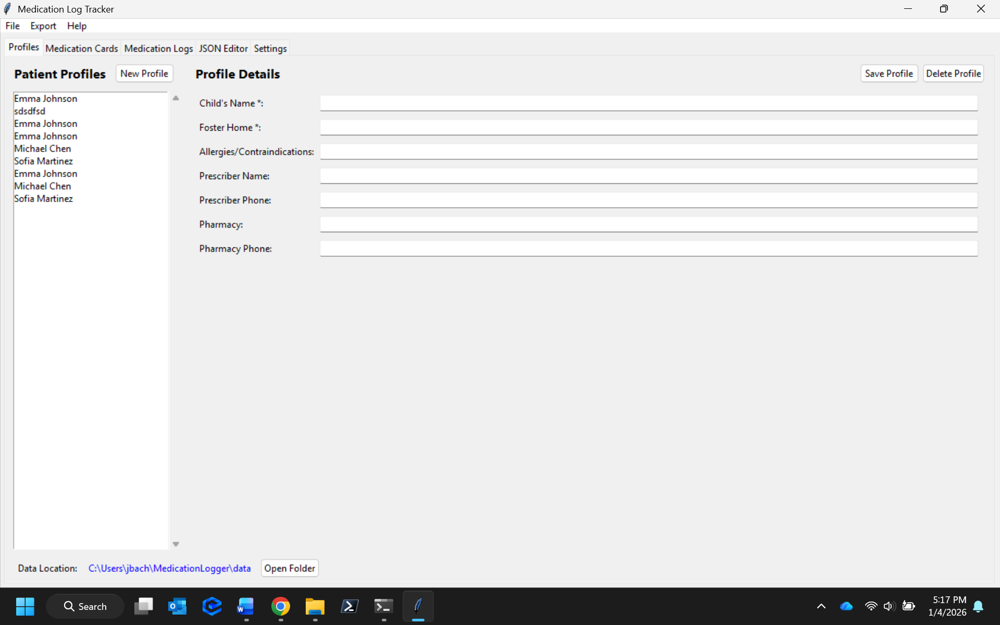

# Medication Logger

A desktop application for tracking medication administration in foster care environments. Built with Python and Tkinter, designed for easy deployment as a standalone executable.

[](https://www.python.org/downloads/)
[](LICENSE)
[]()

## 📋 Table of Contents

- [Overview](#overview)
- [Screenshots](#screenshots)
- [Features](#features)
- [Installation](#installation)
  - [For End Users](#for-end-users)
  - [For Developers](#for-developers)
- [Usage](#usage)
- [Building for Distribution](#building-for-distribution)
- [Architecture](#architecture)
- [Data Storage](#data-storage)
- [Contributing](#contributing)
- [What's New in v1.0](#whats-new-in-v10)
- [Project Status](#project-status)
- [Roadmap](#roadmap)
- [Changelog](#changelog)
- [License](#license)

## 🎯 Overview

Medication Logger helps foster care providers maintain accurate medication administration records. The application provides an intuitive interface for tracking medications, creating administration logs, and generating professional reports.

**Key Highlights:**
- ✅ **Standalone Application** - No Python installation required for end users
- ✅ **Local Data Storage** - All data stored securely on the user's computer
- ✅ **Professional Reports** - Export to Word, PDF, and Excel formats
- ✅ **Mobile Image Support** - Direct upload from iPhone (HEIC) and Android (WebP)
- ✅ **Data Integrity** - Atomic file writes prevent data loss
- ✅ **Easy Backup** - Simple file-based data storage
- ✅ **Cross-Platform** - Works on Windows, macOS, and Linux
- ✅ **Production Ready** - Comprehensive error handling and memory leak prevention

## 📸 Screenshots

### Patient Profiles
Manage patient information, prescribers, and pharmacy details with an intuitive interface.



### Medication Cards
Create reusable medication templates with image support for easy identification.


### Medication Logs
Track daily medication administration with dual view modes - calendar and detailed list.


### Export Options
Export to Word, PDF, and Excel with customizable options and auto-open after export.


## ✨ Features

### Patient Management
- Create and manage patient profiles
- Track prescriber and pharmacy information
- Record allergies and medical contraindications
- Search and filter patients

### Medication Cards
- Create reusable medication templates
- Add medication images for easy identification
- **Mobile image support** - Upload directly from iPhone (HEIC/HEIF) or Android (JPEG/WebP)
- **Image validation** - Automatic format, size, and dimension checking
- Track dosage, strength, and administration instructions
- Store prescribing information and PRN reasons

### Medication Logs
- Monthly administration logs for each medication
- Track date, time, initials, and amount remaining
- Multiple administrations per day support
- **Dual view modes** - Calendar view or detailed list view
- Click on calendar days to quickly add entries
- Visual indicators for days with administrations

### Export & Reporting
- **Word Documents** - Editable `.docx` files (no Word installation required)
- **PDF Reports** - Print-ready documents (Windows only, **requires activated Microsoft Word**)
- **Excel Spreadsheets** - Data for analysis (no Excel installation required)
- Customizable export options
- Batch export multiple logs
- **Auto-open exported files** - Checkbox to automatically open folder after export

### Settings & Preferences
- **Settings tab** - Configure application preferences
- **Default export folder** - Set your preferred export location
- **View data location** - See where your data is stored
- **Settings persistence** - Preferences saved across sessions

### Data Management & Reliability
- **Atomic file writes** - Prevents data corruption during saves
- **Automatic data migration** - Seamless upgrades from old versions
- **Error recovery** - Graceful handling of initialization failures
- User data stored in home directory (`~/MedicationLogger/`)
- **Quick access** - "Open Folder" button to view data location
- Independent of application location
- Easy backup and restore (just copy the folder!)
- Comprehensive logging for troubleshooting
- UTF-8 encoding support for international characters

### 📱 Mobile Image Support

Upload medication photos directly from your smartphone:

**iPhone:**
- ✅ HEIC/HEIF (default format on iOS 11+)
- ✅ JPEG (compatibility mode)
- ✅ PNG (screenshots)

**Android:**
- ✅ JPEG (most common)
- ✅ WebP (newer devices)
- ✅ PNG (screenshots)

**Also Supported:** GIF, BMP, TIFF

**Automatic Validation:**
- Maximum file size: 10 MB
- Maximum dimensions: 4000×4000 pixels
- Format verification to prevent corrupted files

## 💻 Installation

### System Requirements

**All Export Formats:**
- Windows 10/11, macOS 10.14+, or Linux
- 100 MB free disk space

**PDF Export (Optional):**
- **Microsoft Word must be installed AND activated** (licensed/signed in)
- Word is used to convert .docx files to PDF
- If Word is not available: Export to .docx only, then use free online PDF converters

**Note:** Word and Excel documents can be created without Microsoft Office installed. Only PDF export requires Word.

### For End Users

**Download and Run:**

1. Download the latest release from the [Releases](../../releases) page
2. Extract the ZIP file to your preferred location
3. Run `MedicationLogger.exe` (Windows) or `MedicationLogger` (macOS/Linux)
4. Your data will be automatically stored in `~/MedicationLogger/`

**No installation or Python required!**

See [USER_README.md](USER_README.md) for detailed end-user documentation.

### For Developers

**Prerequisites:**
- Python 3.8 or higher
- pip (Python package installer)

**Setup:**

```bash
# Clone the repository
git clone https://github.com/Jmbach88/TexasFosterMedLog.git
cd medication-logger

# Install dependencies (includes pillow-heif for iPhone HEIC support)
pip install -r requirements.txt

# Run in development mode
python main.py
```

**Development Data Location:**
During development, data is stored in `~/MedicationLogger/data/` to avoid conflicts with the development environment.

**Note:** The `pillow-heif` package enables HEIC/HEIF image support from iPhones. If installation fails on your platform, the app will still work but won't support HEIC images.

See [INSTALLATION.md](INSTALLATION.md) for detailed installation instructions.

## 🚀 Usage

### Quick Start

1. **Create a Patient Profile**
   - Click "Add Profile" in the Profiles tab
   - Enter patient information
   - Save the profile

2. **Create a Medication Card** (Optional)
   - Go to the Medication Cards tab
   - Select a patient
   - Add medication details and images

3. **Create a Medication Log**
   - Go to the Logs tab
   - Select a patient and month/year
   - Enter medication information
   - Start recording administrations

4. **Export Reports**
   - Select "Export → Export Medication Log..."
   - Choose patient and log
   - Select export format(s)
   - Choose destination folder

### Data Location

All user data is stored in:
- **Windows:** `C:\Users\<username>\MedicationLogger\`
- **macOS:** `/Users/<username>/MedicationLogger/`
- **Linux:** `/home/<username>/MedicationLogger/`

Structure:
```
MedicationLogger/
├── data/
│   ├── profiles.json          # Patient profiles
│   └── patients/              # Patient-specific data
│       └── <patient_id>/
│           ├── logs/          # Medication logs
│           ├── medication_cards.json
│           └── images/
└── logs/                      # Application logs
```

## 🏗️ Building for Distribution

### Quick Build

```bash
# Build standalone executable
python build.py

# Output will be in dist/MedicationLogger/
```

### Build Options

```bash
# Build without incrementing version
python build.py --no-increment

# Clean build directories only
python build.py --clean-only

# Build without creating zip
python build.py --no-zip
```

See [BUILD_INSTRUCTIONS.md](BUILD_INSTRUCTIONS.md) for detailed build documentation.

## 🏛️ Architecture

The application follows a clean separation of concerns with a modular architecture:

```
┌─────────────────────────────────────┐
│      GUI Layer (Tkinter)            │
│   - User interface only             │
│   - No business logic               │
└─────────────────────────────────────┘
              ↓ uses ↓
┌─────────────────────────────────────┐
│      Business Logic Layer           │
│   - ProfileManager                  │
│   - LogManager                      │
│   - MedicationCardManager           │
│   - ExportManager                   │
│   - ResourceManager                 │
└─────────────────────────────────────┘
              ↓ uses ↓
┌─────────────────────────────────────┐
│      Data Storage (JSON)            │
│   - Local file system               │
│   - User data directory             │
└─────────────────────────────────────┘
```

### Key Design Principles

1. **Separation of Concerns** - GUI independent of business logic
2. **Interface Swappable** - Could replace Tkinter with web/mobile interface
3. **Testable** - Core modules can be tested independently
4. **Resource Management** - Single source of truth for all file paths
5. **Development/Production Parity** - Works the same in both modes

See [ARCHITECTURE.md](ARCHITECTURE.md) for detailed architecture documentation.

## 💾 Data Storage

### File Format
Data is stored in JSON format for:
- Easy backup and restore
- Human-readable format
- Version control friendly
- Cross-platform compatibility

### Backup Recommendations

**For End Users:**
1. Close the application
2. Copy the entire `~/MedicationLogger/` folder
3. Store on external drive or cloud storage
4. Backup weekly or after significant changes

**For Developers:**
The data directory can be version controlled separately, or you can use the application's export features to create backups.

## 🤝 Contributing

Contributions are welcome! Here's how you can help:

### Reporting Bugs
- Use the [Issues](../../issues) page
- Include steps to reproduce
- Include log files from `~/MedicationLogger/logs/`
- Specify your OS and Python version

### Feature Requests
- Open an issue with the "enhancement" label
- Describe the use case
- Explain how it would help foster care providers

### Pull Requests
1. Fork the repository
2. Create a feature branch (`git checkout -b feature/amazing-feature`)
3. Make your changes
4. Test thoroughly in development mode
5. Update documentation as needed
6. Commit your changes (`git commit -m 'Add amazing feature'`)
7. Push to your branch (`git push origin feature/amazing-feature`)
8. Open a Pull Request

### Development Guidelines
- Follow PEP 8 style guidelines
- Maintain separation between GUI and business logic
- Add comments for complex logic
- Update ARCHITECTURE.md if changing structure
- Test in both development and bundled modes

## 📄 License

This project is licensed under the MIT License - see the [LICENSE](LICENSE) file for details.

## 🙏 Acknowledgments

- Built for foster care providers
- Designed to simplify medication administration tracking
- Focused on ease of use and reliability

## 📞 Support

- **Documentation:** See the documentation files in the repository
- **Changelog:** [CHANGELOG.md](CHANGELOG.md) - Version history and upgrade notes
- **Issues:** [GitHub Issues](../../issues)
- **User Guide:** [USER_README.md](USER_README.md)
- **Build Guide:** [BUILD_INSTRUCTIONS.md](BUILD_INSTRUCTIONS.md)

## 🗺️ Roadmap

### ✅ Version 1.0 - Completed
- ✅ Patient profile management
- ✅ Medication log tracking with calendar view
- ✅ Medication card templates with images
- ✅ Word/PDF/Excel export
- ✅ Standalone executable packaging
- ✅ Automatic data migration
- ✅ **Mobile image support (HEIC/WebP)**
- ✅ **Atomic file writes for data integrity**
- ✅ **Comprehensive error handling**
- ✅ **Memory leak prevention**
- ✅ **Image validation**
- ✅ **Data location quick access**

### Version 1.1 - Planned
- [ ] **Direct PDF export** - ReportLab-based PDF generation (eliminates Word requirement)
- [ ] Enhanced search and filtering
- [ ] Medication interaction warnings
- [ ] Automated refill reminders
- [ ] Custom export templates
- [ ] Print preview

### Version 2.0 - Future
- [ ] Web interface option
- [ ] Mobile companion app
- [ ] Cloud backup integration (optional)
- [ ] Multi-user support with permissions
- [ ] Database backend option (SQLite/PostgreSQL)

### Long-term Vision
- [ ] HIPAA compliance mode
- [ ] Barcode scanning for medication verification
- [ ] API for third-party integration
- [ ] Advanced reporting and analytics
- [ ] Integration with pharmacy systems

## 📝 What's New in v1.0

### New Features
- 📱 **Mobile Image Support** - Direct upload from iPhone (HEIC/HEIF) and Android (WebP)
- 🗂️ **Quick Data Access** - "Open Folder" button on Profiles tab to view data location
- 📅 **Calendar View** - Visual calendar interface for viewing medication logs
- ⚙️ **Settings Tab** - Configure default export folder and view data location
- 📂 **Auto-Open After Export** - Checkbox to automatically open folder after successful export

### Reliability Improvements
- 🛡️ **Atomic File Writes** - Prevents data corruption if app crashes during save
- ✅ **Image Validation** - Automatic checks for format, size, and dimensions
- 🔧 **Error Recovery** - Graceful handling of initialization failures
- 🧹 **Memory Leak Fix** - Calendar view properly cleans up event handlers
- 📋 **Template Validation** - Verifies export template before generating documents

### Technical Improvements
- UTF-8 encoding throughout for international character support
- Comprehensive error handling with clear user messages
- Improved file I/O with proper exception handling
- Production-ready stability and data integrity

📋 **[View Full Changelog](CHANGELOG.md)** for complete version history and upgrade notes.

---

## 📊 Project Status

**Current Version:** 1.0.0
**Status:** Production Ready
**Platform Support:** Windows (Primary), macOS, Linux (Experimental)
**Reliability:** Data integrity protection with atomic writes
**Mobile Ready:** Full support for iPhone and Android image formats

---

**Made with ❤️ for foster care providers**

## Detailed Usage Guide (Legacy)

### 1. Profiles Tab

**Create a Profile:**
1. Click "New Profile"
2. Fill in required fields (Child's Name, Foster Home)
3. Add optional information (allergies, prescriber, pharmacy)
4. Click "Save Profile"

**Edit a Profile:**
1. Select profile from list
2. Modify fields
3. Click "Save Profile"

**Delete a Profile:**
1. Select profile from list
2. Click "Delete"
3. Confirm deletion (logs are preserved)

### 2. Medication Logs Tab

**Create a New Log:**
1. Select patient from dropdown
2. Click "New Log"
3. Enter month/year and medication details
4. Click "Create"

**Add Administration Entries:**
1. Select patient and month/year
2. Enter day (1-31), time, initials, and amount remaining
3. Click "Add Entry"
4. Repeat for each dose (up to 3 per day)

**Edit Medication Info:**
1. Load a log
2. Update medicine name, strength, or dosage
3. Click "Save Med Info"

**Delete Entries:**
- Select entry in list and click "Delete Selected"
- Or enter day number and click "Clear All for Day"

### 3. JSON Editor Tab

**View Raw Data:**
1. Load a log in the Medication Logs tab
2. Switch to JSON Editor tab
3. Click "Load Current Log"

**Edit Data:**
1. Modify JSON text directly
2. Click "Save Changes"
3. Changes are validated before saving

**Use Cases:**
- Bulk editing multiple entries
- Copying data between logs
- Advanced troubleshooting

### 4. Export

**Generate Documents:**
1. Load the log you want to export
2. Go to File → Export Current Log
3. Select output directory
4. Word (.docx) and PDF files are generated

## Data Storage

### Profiles
All profiles stored in: `data/profiles.json`

Format:
```json
{
  "profile_id": {
    "child_name": "Patient Name",
    "foster_home": "Foster Home Name",
    "allergies": "List of allergies",
    "prescriber_name": "Dr. Name",
    "prescriber_phone": "(555) 555-5555",
    "pharmacy": "Pharmacy Name",
    "pharmacy_phone": "(555) 555-5555",
    "created_at": "2024-12-20T10:30:00",
    "updated_at": "2024-12-20T10:30:00"
  }
}
```

### Logs
Individual log files in: `data/logs/`

Filename format: `{profile_id}_{month_year}.json`

Example: `emma_johnson_december_2024.json`

Format:
```json
{
  "profile_id": "emma_johnson",
  "month_year": "December 2024",
  "medicine_name": "Medication Name",
  "strength": "250mg",
  "dosage": "1 tablet",
  "administration_log": [
    {
      "day": 1,
      "time": "8:00 AM",
      "initials": "JS",
      "amount_remaining": "29 doses"
    }
  ],
  "created_at": "2024-12-01T08:00:00",
  "updated_at": "2024-12-20T10:30:00"
}
```

## Backup

**Manual Backup:**
Simply copy the entire `data/` folder to a USB drive or backup location.

**Restore:**
Copy the `data/` folder back to the application directory.

## Modular Architecture

This application is designed with separation of concerns:

- **Core modules** (`core/`) contain all business logic and are GUI-independent
- **GUI modules** (`gui/`) only handle user interface
- This makes it easy to swap interfaces (web, mobile, CLI) without changing core logic

### Swapping the GUI

To use a different interface:

1. Keep the `core/` modules unchanged
2. Create a new GUI module (e.g., `gui/web_app.py`)
3. Import and use the same managers:

```python
from core.profiles import ProfileManager
from core.logs import LogManager
from core.export import ExportManager

# Use identical methods with different UI
profile_manager = ProfileManager()
profiles = profile_manager.get_all_profiles()
```

## Security Notes

### Current (Local Use)
- All data stored locally in JSON files
- No encryption (files are human-readable)
- Suitable for single-computer use
- Privacy through physical access control

### Future (Network/Mobile Use)
When adding network access, implement:
- User authentication (username/password)
- Data encryption at rest and in transit
- Role-based access control
- Audit logging
- HIPAA compliance measures

## Troubleshooting

**PDF Export Not Working:**
- Windows: Install `docx2pdf` with `pip install docx2pdf`
- Mac/Linux: Install LibreOffice and modify export code
- Alternative: Open .docx files and Save As PDF manually

**Template Not Found:**
- Ensure `med_log_template.docx` is in `templates/` folder
- Check that template path in code matches actual location

**Data Not Saving:**
- Check file permissions on `data/` folder
- Ensure sufficient disk space
- Look for JSON syntax errors in editor tab

**Application Won't Start:**
- Verify Python 3.7+ is installed
- Install required packages: `pip install python-docx`
- Check for error messages in terminal

## Development

### Running from Source

```bash
cd medication_tracker
python main.py
```

### Creating Executable (Windows)

```bash
pip install pyinstaller
pyinstaller --onefile --windowed --add-data "templates;templates" main.py
```

The executable will be in `dist/main.exe`

### Adding Features

Since the architecture is modular:

1. Add business logic to `core/` modules
2. Add UI components to `gui/` modules
3. Keep them separate for easy maintenance

## License

This application is for personal/organizational use. Modify as needed for your requirements.

## Support

For issues or questions, refer to the code documentation or modify the application to suit your needs.
